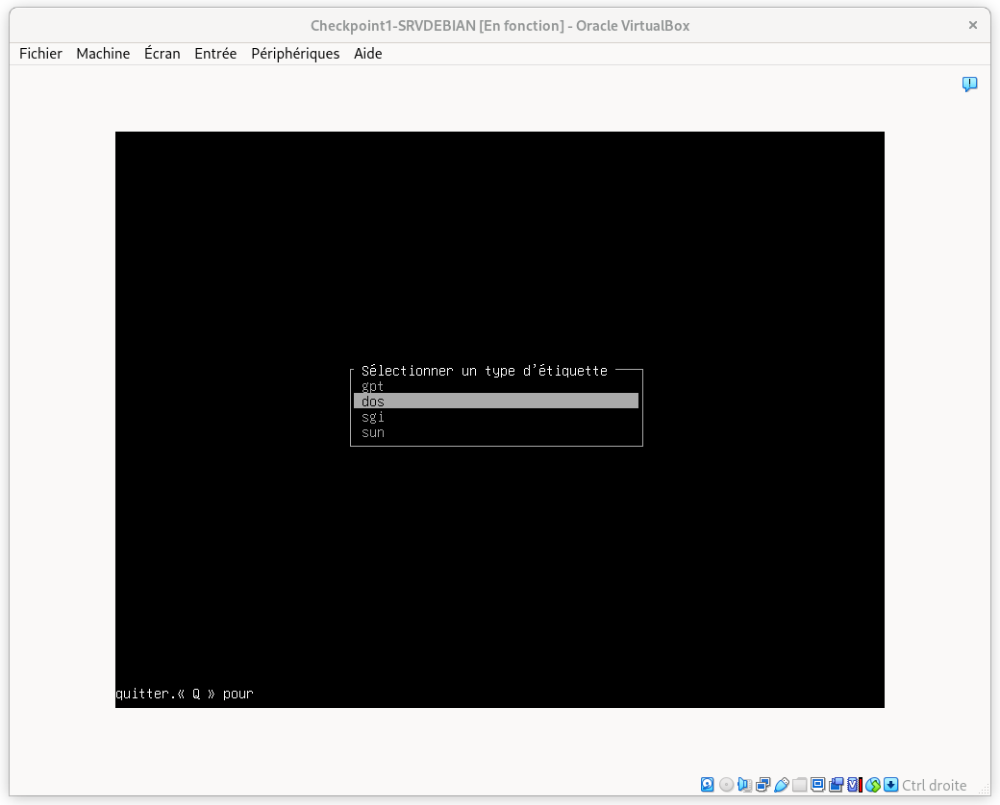
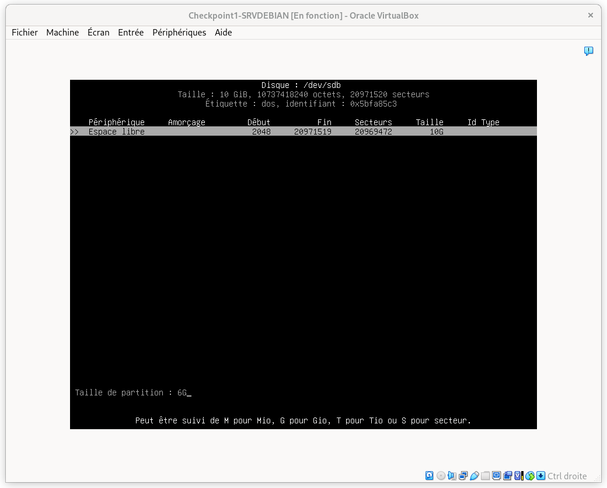
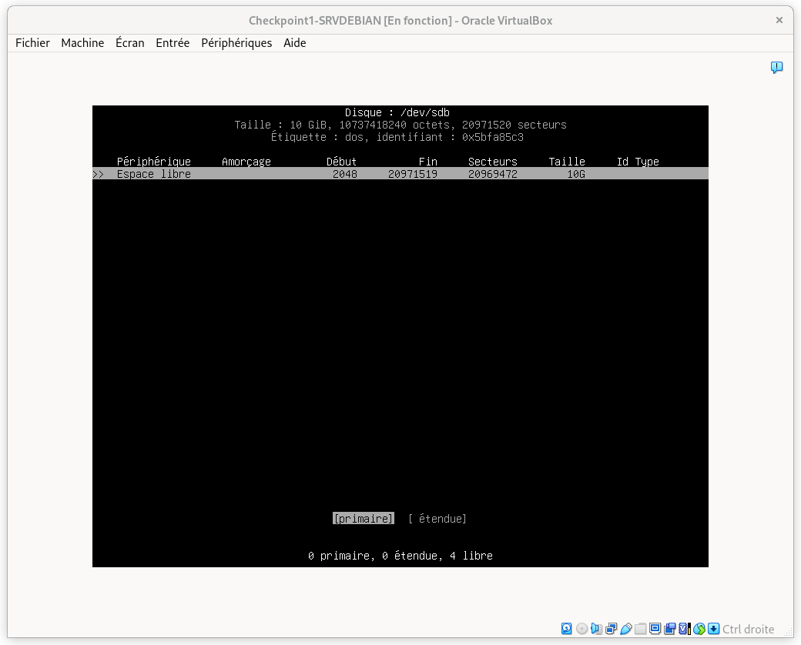
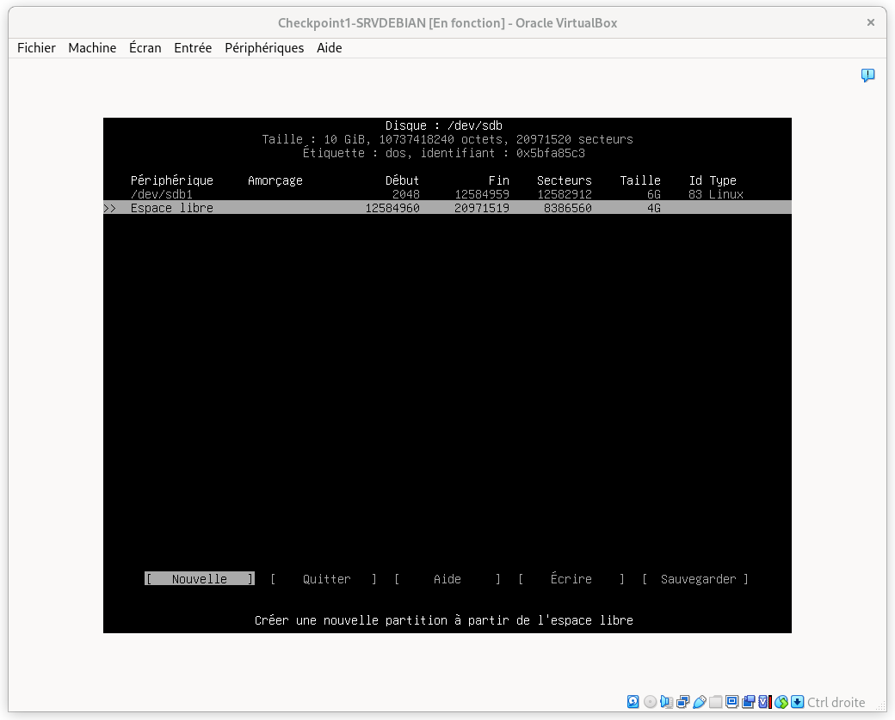
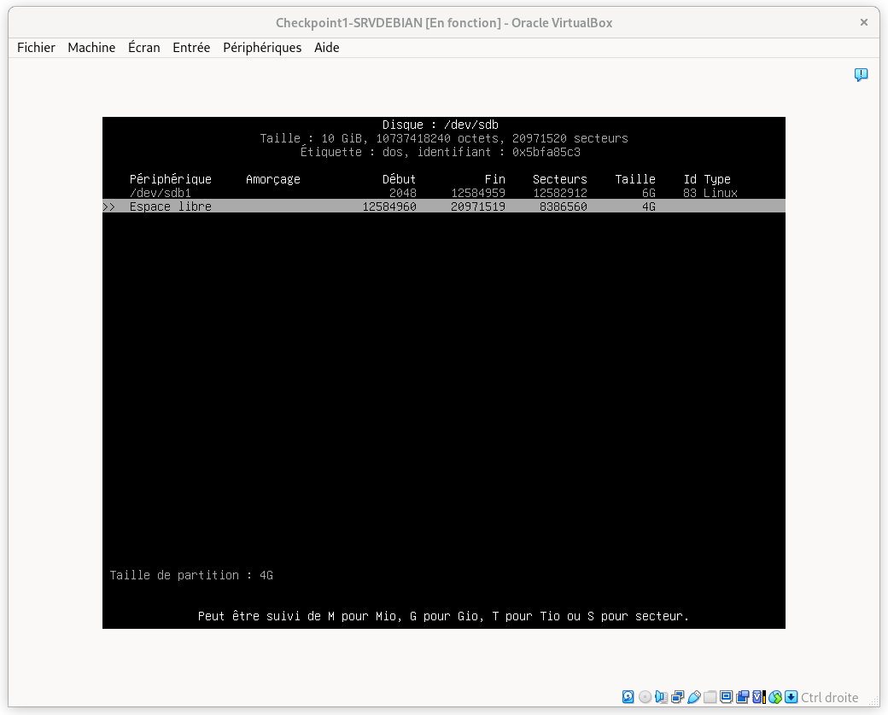
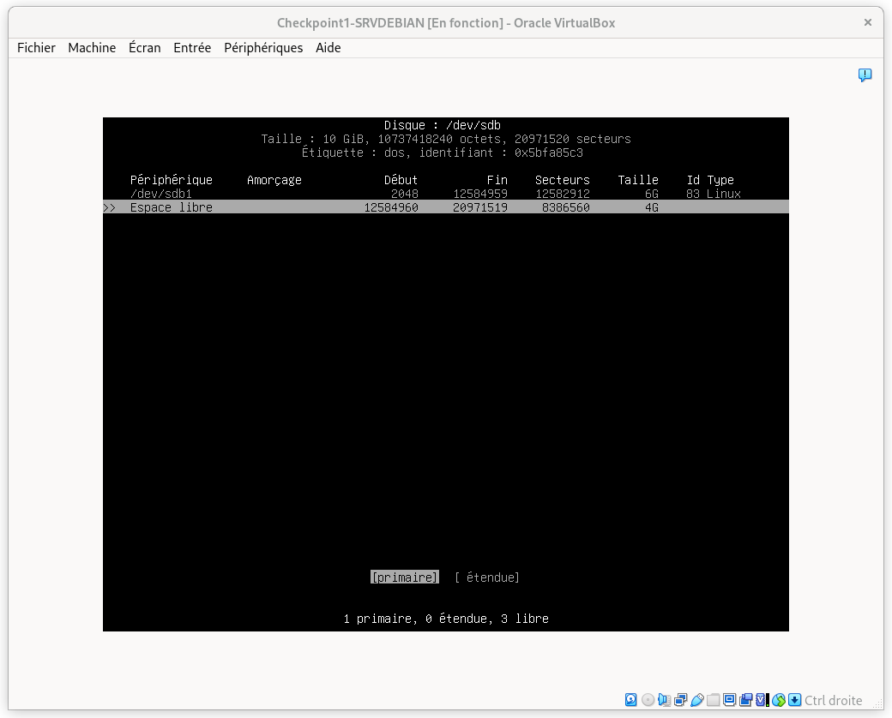
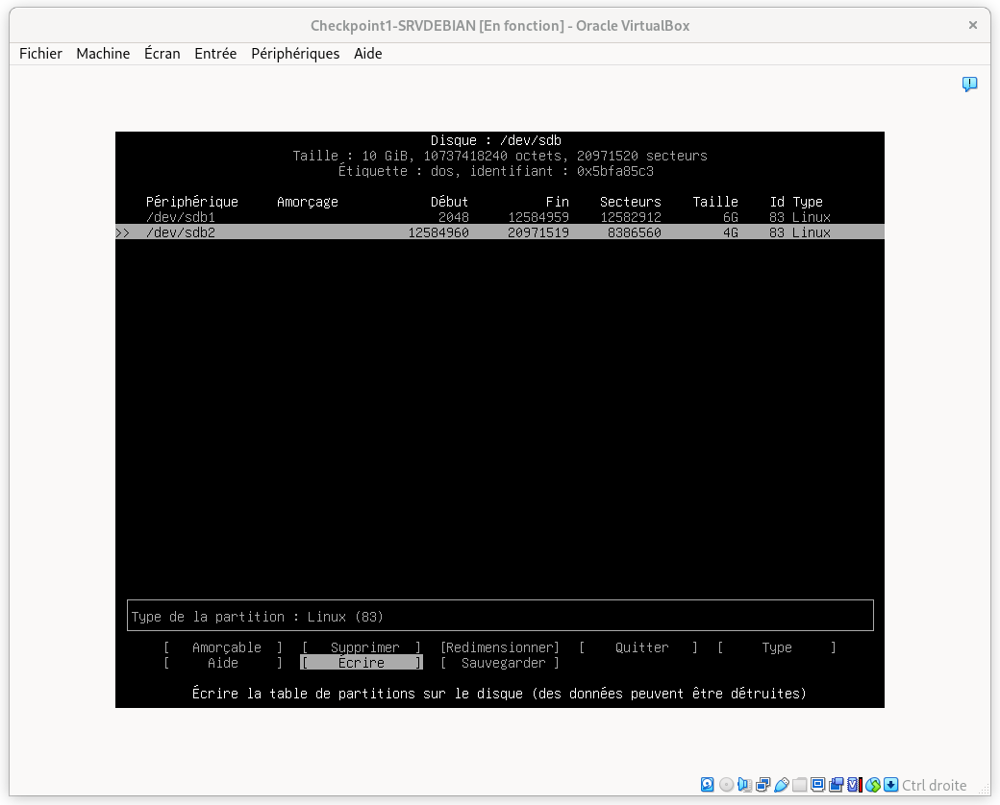
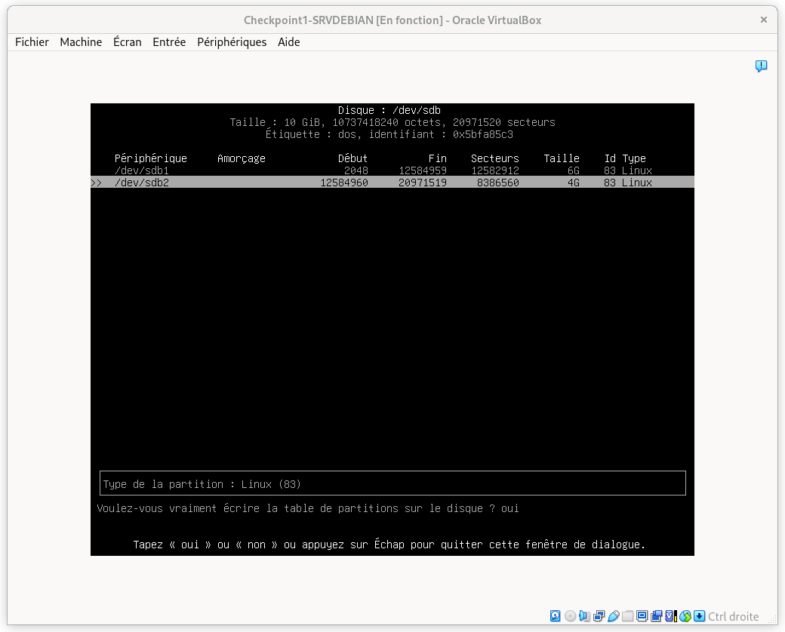
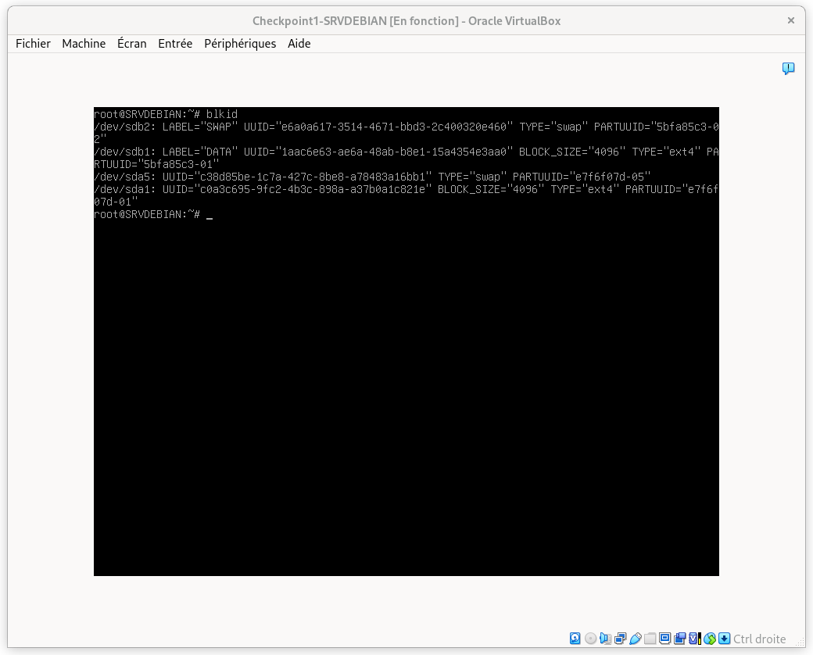
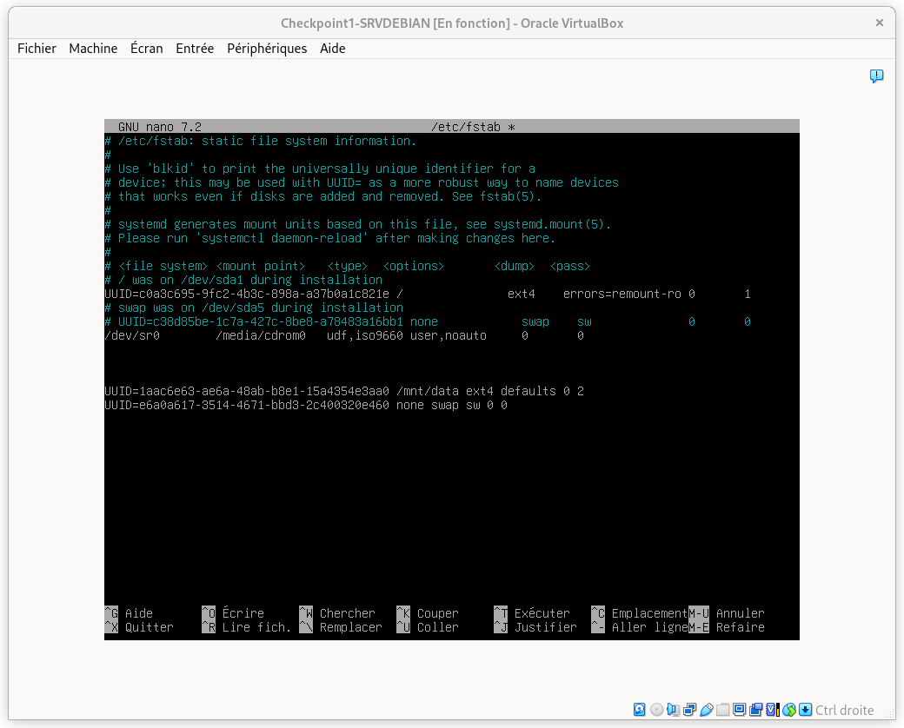

#  Exercice 1

## Création des partitions

Se connecter en root avec le mot de passe ``tSsrsRvdEbianrOot01!``

Pour créer les deux partitions sur le deuxième disque, on commence par lancer :

```
cfdisk /dev/sdb
```

Puis, il faut choisir **dos** :



On choisit alors d'initialiser sur l'espace libre du disque (les 10Go totaux du disque ici) :


On choisit la taille de la première partition, soit 6G :



On choisit d'en faire une partition primaire :



On répète le processus pour la deuxième partition :



Cette fois on laisse 4G pour la taille de partition :



On choisit une nouvelle fois primaire :



Puis on écrit les partitions :



Et on valide notre choix :



On peut enfin quitter l'utilitaire.

## Formater les partitions

On formate la première partition avec la commande suivante :

```bash
mkfs.ext4 -L DATA /dev/sdb1
```

On formate la deuxième partition en swap avec la commande :

```bash
mkswap -L SWAP /dev/sdb2
```

On active la partition de swap avec la commande :

```bash
swapon /dev/sdb2
```

## Montage

La commande `blkid` permet de récupérer les UUID des disques :



On en profite pour constater que les partitions ont bien été nommées DATA et SWAP.

Pour monter automatiquement les partitions au lancement de la machine il faut ajouter les informations des partitions au fichier **/etc/fstab**. On peut le faire avec ces commandes :

```bash
echo "UUID=1aac6e63-ae6a-48ab-b8e1-15a4354e3aa0 /mnt/data ext4 defaults 0 2" >> /etc/fstab

echo "UUID=e6a0a617-3514-4671-bbd3-2c400320e460 none swap sw 0 0" >> /etc/fstab
```

On peut vérifier que l'addition au fichier s'est bien faite avec 
```bash
nano /etc/fstab
```

Et on en profite pour commenter la ligne qui concernait la partition swap précédente ainsi :



## Vérification

On redémarre le système avec la commande :

```bash
reboot
```

Et on vérifie que nos partitions sont correctement montées avec :

```bash
df -h
```

